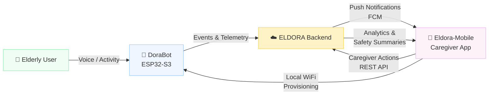
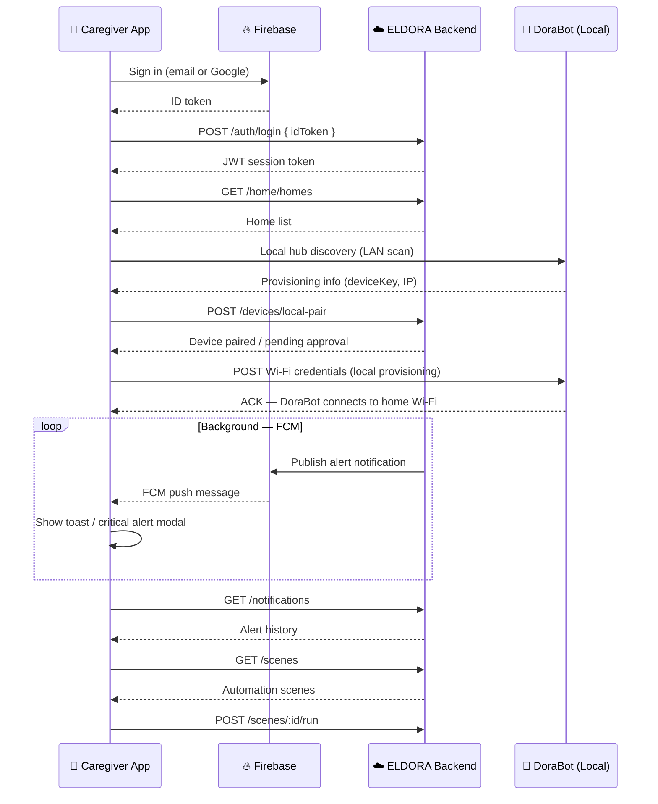

<div align="center">

# 📱 Eldora-Mobile — ELDORA Caregiver App

### *Protect. Respond. Recover.*

[](https://reactnative.dev/)
[](https://expo.dev/)
[](https://www.typescriptlang.org/)
[](https://firebase.google.com/)
[](LICENSE)
[](https://github.com/)

<br/>

**The caregiver-facing mobile app for the ELDORA ecosystem — handling multi-home management, DoraBot pairing and Wi-Fi provisioning, real-time fall and safety alerts, scene automation, voice configuration, and elder analytics.**

[🌐 ELDORA Ecosystem](https://github.com/eldora-bm) · [🤖 DoraBot](https://github.com/eldora-bm/dorabot) · [🛡️ DoraShield](https://github.com/eldora-bm/dorashield) · [☁️ Backend](https://github.com/eldora-bm/eldora-backend)

</div>

---

## 📌 Overview

Eldora-Mobile is the **caregiver's command center** in the ELDORA eldercare ecosystem. Built with Expo and React Native, it lets family members and professional caregivers monitor elderly safety in real time, onboard and configure DoraBot devices, manage multi-home environments, set up scene automations, and receive instant push notifications — including critical fall alerts with vibration override.

> **Eldora-Mobile's role in the ELDORA ecosystem:**
> *"The caregiver's window — always connected, always informed, always one tap away from responding."*

| | |
|---|---|
| **Platform** | Android (primary), iOS |
| **Framework** | Expo SDK 55 + React Native 0.83.4 |
| **Language** | TypeScript |
| **Auth** | Firebase Auth — email/password + Google Sign-In |
| **Push Notifications** | Firebase Cloud Messaging (FCM) + Expo Notifications |
| **State Management** | Zustand + AsyncStorage |
| **Data Fetching** | TanStack Query v5 |
| **Styling** | NativeWind v4 (Tailwind-style utility classes) |

---

## 🌐 ELDORA Ecosystem

Eldora-Mobile is the **Recover** layer of ELDORA's three-phase safety framework:

```
ELDORA Ecosystem
├── 🛡️  DoraShield     — Fall detection wearable (ESP32)
├── 🤖  DoraBot         — AI voice companion (ESP32-S3)
├── ☁️   ELDORA Backend  — AI processing, device orchestration, API
└── 📱  Eldora-Mobile   — Caregiver dashboard (this repo)
```



---

## ✨ App Features

- 🔐 **Firebase Authentication** — email/password login, Google Sign-In, and new account registration
- 🏠 **Multi-Home Management** — create and switch between multiple elder homes from a unified selector
- 🤖 **DoraBot Local Discovery & Pairing** — scans the local Wi-Fi network to find DoraBot, pairs it to a caregiver account, and manages pairing approval requests
- 📶 **DoraBot Wi-Fi Provisioning** — pushes home Wi-Fi credentials directly to an unpaired DoraBot over its local provisioning endpoint
- 📊 **Device Dashboard** — lists all paired ELDORA devices (DoraBot + DoraShield) with online/offline status and room-based filtering
- 🔔 **Real-Time Alerts & Notifications** — receives fall, home, and device alerts via FCM; supports critical alert modals with continuous vibration until dismissed
- 🎬 **Scene Automation** — build, manage, and run tap-to-run automation scenes grouped by device and room
- 📈 **Elder Analytics** — time-series activity and emotion analytics with configurable periods (1 day, 7 days, 30 days, 90 days)
- 🎙️ **DoraBot Voice Configuration** — select TTS voice, accent, and speech rate per device; play a test audio clip before saving
- 🏡 **Home Administration** — manage home name, location, members, and join an existing home via invite
- 🔕 **Notification Preferences** — per-category notification settings, with FCM token registration and automatic token refresh
- 📱 **Guided Onboarding** — multi-screen onboarding flow for first-time caregiver setup

---

## 🛠️ Tech Stack

| Layer | Technology | Purpose |
|---|---|---|
| **Framework** | Expo SDK 55 + React Native 0.83.4 | Cross-platform mobile app |
| **Language** | TypeScript 5.9 | Type-safe development throughout |
| **Navigation** | Expo Router (file-based) | Screen routing with protected route guards |
| **State Management** | Zustand + AsyncStorage | Global auth and home state with persistence |
| **Data Fetching** | TanStack Query v5 | Server state, caching, and background refetch |
| **Authentication** | Firebase Auth + `@react-native-firebase/auth` | Email/password and Google Sign-In |
| **Push Notifications** | Firebase Cloud Messaging + Expo Notifications | Real-time alerts, critical alert channels |
| **HTTP Client** | Axios | REST API communication with ELDORA backend |
| **Forms & Validation** | React Hook Form + Zod | Sign-in, sign-up, Wi-Fi config forms |
| **Styling** | NativeWind v4 + Tailwind CSS | Utility-class styling |
| **Icons** | Lucide React Native | Consistent icon set throughout the UI |
| **Audio** | expo-audio | TTS voice test playback in voice settings |
| **Animations** | React Native Reanimated | Smooth UI transitions |
| **Networking (local)** | expo-network | Wi-Fi state detection for DoraBot discovery |

---

## 📁 Project Structure

```
Eldora-Mobile/
│
├── 📁 app/                         # Expo Router screen files (file-based routing)
│   ├── _layout.tsx                 # Root layout — auth guard, FCM setup, critical alert modal
│   ├── index.tsx                   # Entry redirect (auth → home or onboarding)
│   ├── onboarding.tsx / welcome.tsx / signin.tsx / signup.tsx
│   ├── home.tsx                    # Device dashboard — DoraBot status, pairing, device list
│   ├── alerts.tsx / alert-detail.tsx
│   ├── scene.tsx / scene-builder.tsx / create-scene.tsx / scene-detail.tsx
│   ├── analytics.tsx
│   ├── settings.tsx / account.tsx / personal-information.tsx / account-security.tsx
│   ├── notification-settings.tsx / voice-settings.tsx
│   ├── home-management.tsx / home-settings.tsx / home-member.tsx / home-location.tsx / join-home.tsx
│   ├── device-management.tsx / device-detail.tsx / device-setup.tsx / add-device.tsx
│   └── room-management.tsx
│
├── 📁 src/
│   ├── 📁 api/                     # API query function modules (analyticsApi, devicesApi, …)
│   ├── 📁 components/              # Reusable UI components grouped by domain
│   │   ├── auth/                   # AuthField
│   │   ├── cards/                  # AlertCard, DiscoveredHubCard
│   │   ├── devices/                # AddDeviceMenu, WifiConfigModal, ScanningRadar, …
│   │   ├── home/                   # HomeSelectorMenu, PairingRequestCard, DeviceStatusCard, …
│   │   ├── navigation/             # BottomNav, MainTabScreen, ScreenHeader
│   │   ├── scene/                  # SceneListRow, SceneFilterPill, SceneEmptyState, …
│   │   ├── settings/               # MeMenuRow, SettingsRow, NotificationPreferenceRow, …
│   │   └── ui/                     # Button, Card, Input, LoadingSpinner
│   ├── 📁 constants/               # api.ts (endpoints), theme.ts, sceneTemplates.ts
│   ├── 📁 hooks/                   # TanStack Query hooks per domain (useDeviceQueries, …)
│   ├── 📁 lib/                     # queryClient.ts
│   ├── 📁 services/                # API service layer (authService, deviceService, …)
│   ├── 📁 stores/                  # Zustand stores (authStore, homeStore, voiceSettingsStore)
│   ├── 📁 types/                   # TypeScript type definitions per domain
│   └── 📁 utils/                   # Formatters, device/home/scene utility functions
│
├── 📄 app.json                     # Expo app configuration (bundle IDs, permissions, plugins)
├── 📄 .env.example                 # Required environment variables
├── 📄 eas.json                     # EAS Build configuration
└── 📄 .github/workflows/android-build.yml   # CI: Android APK + AAB release build
```

<details>
<summary><b>What each layer does</b></summary>

<br/>

| Layer | Role |
|---|---|
| `app/` | **Screens.** Each file is a route. `_layout.tsx` wires up Firebase FCM, the critical alert modal, and Expo Router auth guards. |
| `src/api/` | **Query functions.** Raw API call functions passed to TanStack Query hooks — one file per domain. |
| `src/hooks/` | **TanStack Query hooks.** `useDeviceQueries`, `useSceneQueries`, etc. — each exports `useXxxQuery` and `useXxxMutation` hooks consumed by screens. |
| `src/services/` | **Service layer.** Thin wrappers over `apiClient` (Axios) that handle request/response shaping per domain. `authService` also drives Firebase Auth calls. |
| `src/stores/` | **Global state.** `authStore` holds the JWT token and hydration flag. `homeStore` tracks the selected home ID across sessions. |
| `src/components/` | **UI building blocks.** Organized by domain so screens stay lean. |

</details>

---

## ⚙️ How the App Works



**In plain English:**
```
App launches → checks auth token (Zustand + AsyncStorage)
    → if unauthenticated: onboarding → sign in → Firebase + backend login
    → if authenticated: home dashboard
        loads homes list from backend
        scans local network for DoraBot (LAN discovery)
        if DoraBot found → pair it to the selected home
        if DoraBot needs Wi-Fi → push credentials over local provisioning endpoint
    → main loop:
        FCM push → toast or critical alert modal (with vibration)
        pull-to-refresh → reload devices, re-run LAN discovery
        navigate to Alerts → full notification history
        navigate to Scenes → automation management
        navigate to Settings → voice config, account, home admin
```

---

## ⚙️ Configuration

Create a `.env` file in the project root (use `.env.example` as the template):

```env
# ELDORA Backend
EXPO_PUBLIC_API_URL=https://your-backend-url.com

# Google OAuth (for Google Sign-In)
EXPO_PUBLIC_GOOGLE_WEB_CLIENT_ID=your-google-web-client-id
EXPO_PUBLIC_GOOGLE_ANDROID_CLIENT_ID=your-google-android-client-id

# Firebase (Authentication + FCM)
EXPO_PUBLIC_FIREBASE_API_KEY=your-firebase-api-key
EXPO_PUBLIC_FIREBASE_AUTH_DOMAIN=your-project.firebaseapp.com
EXPO_PUBLIC_FIREBASE_PROJECT_ID=your-firebase-project-id
EXPO_PUBLIC_FIREBASE_APP_ID=your-firebase-app-id
EXPO_PUBLIC_FIREBASE_STORAGE_BUCKET=your-project.appspot.com
EXPO_PUBLIC_FIREBASE_MESSAGING_SENDER_ID=your-messaging-sender-id
```

> ⚠️ **Never commit `.env` to version control.** All variables prefixed `EXPO_PUBLIC_` are bundled into the app binary — treat them accordingly.

---

## 🚀 Build & Run

### Prerequisites

- [Node.js 20+](https://nodejs.org/)
- [Expo CLI](https://docs.expo.dev/get-started/installation/) (`npm install -g expo-cli`)
- Android Studio (for Android emulator) or a physical Android/iOS device with Expo Go

### Install & Start

```bash
# 1. Clone the repository
git clone https://github.com/eldora-bm/eldora-mobile.git
cd eldora-mobile

# 2. Install dependencies
npm install

# 3. Copy and fill in environment variables
cp .env.example .env
# Edit .env with your backend URL and Firebase/Google credentials

# 4. Start the Expo dev server
npm run start

# 5. Scan the QR code with Expo Go (Android/iOS)
#    or press 'a' to open on an Android emulator
#    or press 'i' to open on an iOS simulator
```

### TypeScript Check

```bash
npx tsc --noEmit
```

### Platform-Specific Runs

```bash
npm run android   # Run directly on Android emulator / connected device
npm run ios       # Run on iOS simulator (macOS only)
npm run web       # Run in browser (limited functionality)
```

<details>
<summary><b>Running on a physical Android device</b></summary>

<br/>

1. Enable **Developer Options** and **USB Debugging** on the device
2. Connect via USB and confirm the ADB prompt on the device
3. Run `npm run android` — Expo will install the dev build automatically
4. For FCM push notifications to work, the app must be built with `expo-dev-client` (not plain Expo Go)

</details>

---

## 🔄 CI/CD

The repository includes a GitHub Actions workflow (`.github/workflows/android-build.yml`) for producing signed release builds.

| Step | What it does |
|---|---|
| **Trigger** | Manual (`workflow_dispatch`) |
| **Environment** | Ubuntu latest, Node 20, Java 17 |
| **Prebuild** | `expo prebuild --platform android` generates the native Android project |
| **Signing** | Decodes a base64-encoded keystore from GitHub Secrets and injects signing config into `build.gradle` |
| **Build** | `./gradlew assembleRelease bundleRelease` — produces both APK and AAB |
| **Artifacts** | APK and AAB uploaded as GitHub Actions artifacts |
| **Release** | Creates a versioned GitHub Release (`v1.0.0-build.<run_number>`) with both artifacts attached |

### Required GitHub Secrets

| Secret | Description |
|---|---|
| `EXPO_PUBLIC_API_URL` | Backend API URL |
| `EXPO_PUBLIC_GOOGLE_*_CLIENT_ID` | Google OAuth client IDs |
| `EXPO_PUBLIC_FIREBASE_*` | Firebase configuration values |
| `GOOGLE_SERVICES_JSON` | Base64-encoded `google-services.json` |
| `ANDROID_KEYSTORE_BASE64` | Base64-encoded release keystore |
| `ANDROID_KEYSTORE_PASSWORD` | Keystore password |
| `ANDROID_KEY_ALIAS` | Key alias |
| `ANDROID_KEY_PASSWORD` | Key password |

---

## 👥 Team

<div align="center">

**ELDORA — BINUS BM Team**
*Passage to ASEAN Hackathon 2026*

| Name | Role |
|---|---|
| **Stanley Nathanael Wijaya** | Team Lead |
| **Lutfi Alvaro Pratama** | IoT Engineer |
| **Andrian Pratama** | Mobile Developer |
| **Khalisa Amanda Sifa Ghaizani** | Backend Developer |
| **Devon Nicholas** | AI Engineer |

</div>

---

## 📧 Contact

Have questions, want to collaborate, or interested in ELDORA?

| Channel | Details |
|---|---|
| 📧 Email | [stanley.n.wijaya7@gmail.com](mailto:stanley.n.wijaya7@gmail.com) |
| ✈️ Telegram | [@xstynwx](https://t.me/xstynwx) |
| 💬 Discord | `stynw7` |

---

<div align="center">

[](https://github.com/)
[](https://binus.ac.id/)

<br/>
Made with 🤍 by **BINUS BM Team** 🔥

</div>
